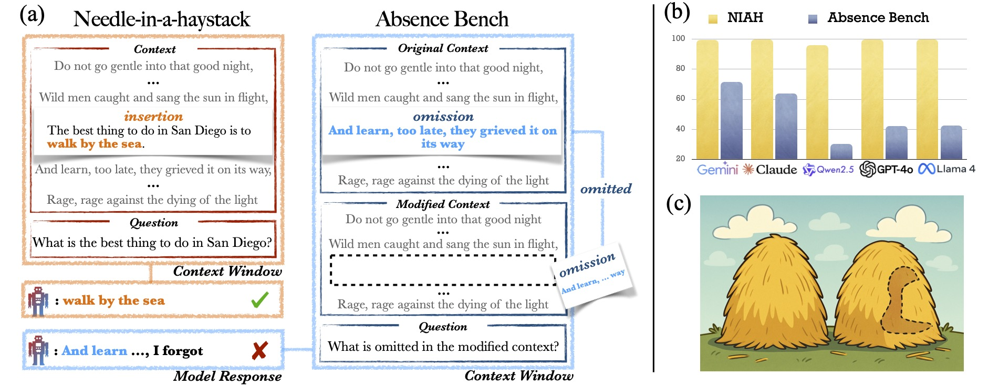
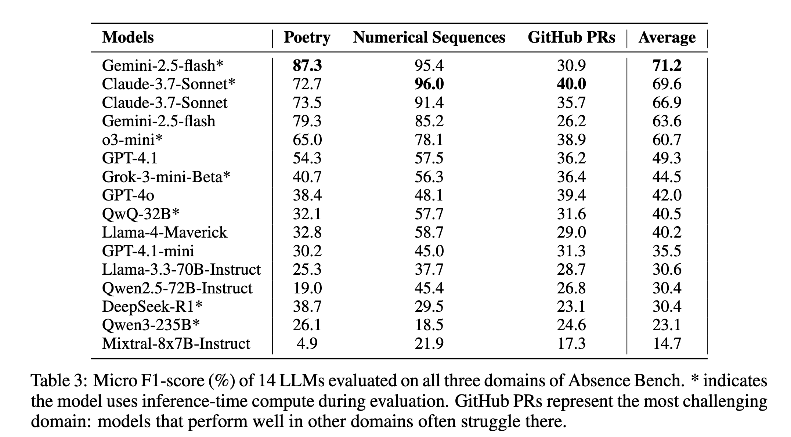

# AbsenceBench:  Language Models Can’t Tell What’s Missing
This repository contains implementation details for our paper [AbsenceBench: Language Models Can't Tell What's Missing](https://arxiv.org/abs/2506.11440). 
AbsenceBench is a new benchmark designed to evaluate the abilities of LLMs in locating conspicuously missing information from long inputs. Instead of asking LLMs to find off-topic information (the ‘needle’ in NIAH), LLMs are prompted to identify and recall intentionally omitted information.
<p align="center">
  
</p>
This repo provides instructions on how to generate the AbsenceBench dataset and run the evaluation.

## Content
- [Setup](#setup)
- [Data](#data)
    - [Data Download](#data-download)
    - [Data Generation](#data-generation)
- [Evaluation](#evaluation)
- [Analysis](#analysis)
- [Citation](#citation)
- [Contact](#contact)


## Setup
### Prerequisites
- Python 3.6 or higher installed
- pip (Python package installer)

### 1. Setting Up a Virtual Environment

```bash
python3 -m venv venv
source venv/bin/activate
```
You'll know your virtual environment is active when you see `(venv)` at the beginning of your terminal prompt.

### 2. Installing Dependencies
Once your virtual environment is activated, install the required packages:
```bash
pip install -r requirements.txt
```
We run all evaluation through API requests. If you would like to do so as well, you will need to install these corresponding packages.
```bash
pip install openai              # Openai API (GPT-4, o3), xAI API (Grok)
                                # OPENAI_API_KEY, XAI_API_KEY

pip install anthropic           # Anthropic API (Claude)
                                # ANTHROPIC_API_KEY

pip install together            # TogetherAI API (Llama, Qwen, Deepseek, Mixtral)
                                # TOGETHER_API_KEY

pip install google-genai        # Google API (Gemini)
                                # GEMINI_API_KEY
```
Note: You'll need to set up the appropriate API keys as environment variables. Here are some [instructions](https://help.openai.com/en/articles/5112595-best-practices-for-api-key-safety).


## Data
AbsenceBench covers three distinct domains:
- Poetry (realistic; 1191 instances)
- Numerical sequences (synthetic; 1200 instances)
- GitHub pull requests (realistic; 887 instances)

There are 4302 instances in total, with an average context length of 5K tokens.

### Data Download
-----
We host the dataset on this Huggingface [repo](https://huggingface.co/datasets/harveyfin/AbsenceBench).
#### Download Data Directly
You can directly download the data by running the script below. The script retrieves the default branch of the dataset, containing one `jsonl` file per domain, and stores it in the `data` directory. The dataset requires approximately 37.8 MB of storage.
```bash
bash scripts/download.sh
```
Note that it is recommended to choose this way of downloading data to perform the evaluations provided in this repository.

#### Download Using 🤗 Datasets
Alternatively, you can download data using 🤗 Datasets.
```python
from datasets import load_dataset
dataset = load_dataset("harveyfin/AbsenceBench", "poetry")
```

### Data Generation
-----
We provide python scripts as well as the source data for generating the full dataset.
#### 1. Download Raw Poetry Data
```bash
bash scripts/download_poetry.sh
```

#### 2. Run Data Construction
```bash
bash scripts/generate_data.sh
```
Note that scraping the GitHub pull requests data may take a long time (around 20 minutes)

## Evaluation
If you wish to evaluate a language model via API, we have provided frameworks for five API providers in `tests/llm_providers.py`. The following is an example script to run evaluations using `Claude-3.7-sonnet`:
```bash
python evaluate.py \
    --model_family anthropic \              # model family (e.g., openai, anthropic)
    --model claude-3.7-sonnet-latest \      # model API reference
    --in_dir tests\                         # directory of evaluation scripts
    --out_dir results\                      # directory of outputs
    --batch_size 10 \                       # batch size
    --thinking                              # (optional) thinking mode
```
Alternatively, to evaluate your own model, modify the `get_response` function [here](https://github.com/harvey-fin/absence-bench/blob/82f8bbe1b30e0f8621536632f6cb0539f777aec8/tests/llm_providers.py#L40) and specify "custom" as the model family in the above script.

### Evaluate on Each Domain
`evaluate.py` executes three distinct test scripts (one for each domain) located under `tests` directory. You can also pass `--run_task poetry` to the above script or directly run the specific test script
```bash
python tests/test_llms_poetry.py \
    --input_file data/poetry.jsonl \        # path to the poetry data
    --provider_models openai:gpt-4 \        # model_family:model
    --output poetry_gpt-4.jsonl \   # path to save the output
    --batch_size 10 \                       # batch size
    --sample_size 5 \                       # (optional) run on several samples only
    --thinking \                            # (optional) thinking mode
```

### Evaluation Results
We evaluate a total of 14 LLMs on AbsenceBench
<p align="center">
  
</p>

## Analysis
In the paper, we perform several analyses on AbsenceBench. This section provides further details regarding data generation and evaluation procedures used in these analyses.

### Needle-in-a-haystack (NIAH)
We compare our evaluation setting to the NIAH test setting in the Poetry and GitHub PRs domains. To generate data for these two domains under the NIAH setting, run the data generation scripts under `dataset_construction` directory separately with the `--use_needles` argument enabled. In addition, you will need to add your own "needles" file to the directory. Example usage that saves data to `data/poetry_needles.jsonl`
```bash
python dataset_construction/process_poetry.py \
    --input_file data/poetry_raw.jsonl \
    --prob 0.1 \
    --use_needles \
```
Note for Github PRs domain, you will need to modify [here](https://github.com/harvey-fin/absence-bench/blob/d347e0b7d2ae6111258af20ec62a976faf965329/dataset_construction/run_prs.py#L40) by enabling the `--use_needles` argument.

#### Evaluate NIAH
Similar to the [evaluation scripts](#evaluate-on-each-domain), pass the `--use_needle` argument to evaluate AbsenceBench under the NIAH setting.

### Placeholders
We analyze the effect of placeholders as an identifier to help language models detect omissions. To generate data with placeholders in place, enable the `--use_placeholders` argument. Evaluation is performed in the default AbsenceBench task setting.
 
## Citation
If you find this work useful, please cite our paper:
```
@misc{fu2025absencebenchlanguagemodelscant,
      title={AbsenceBench: Language Models Can't Tell What's Missing}, 
      author={Harvey Yiyun Fu and Aryan Shrivastava and Jared Moore and Peter West and Chenhao Tan and Ari Holtzman},
      year={2025},
      eprint={2506.11440},
      archivePrefix={arXiv},
      primaryClass={cs.CL},
      url={https://arxiv.org/abs/2506.11440}, 
}
```

## Contact
If you have any questions regarding this repo, or questions that is relevant to AbsenceBench, please email me at `harveyfu@uchicago.edu`.
